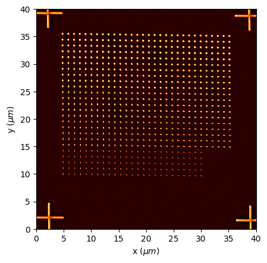
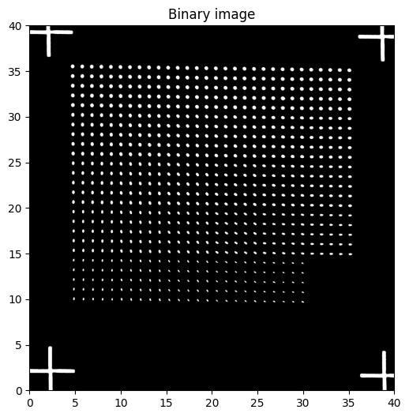

# Raith-SEM-analysis

## Overview
This Python module is designed for processing and analyzing scanning electron microscopy (SEM) images. It provides a set of functions for reading images and metadata, preprocessing images, detecting contours, calculating bounding shapes, and visualizing results. This module is particularly useful for researchers and professionals working with SEM data.

## Features
- **Image Loading**: Supports reading BMP images and associated metadata files.
- **Image Preprocessing**: Includes functions for Gaussian blur and Otsu's thresholding to create binary images.
- **Contour Detection**: Identifies contours in binary images for further analysis.
- **Bounding Shapes Calculation**: Computes minimum area bounding shapes (rectangles, ellipses, circles) for detected contours.
- **Visualization**: Generates plots for original images, binary images, contours, histograms, and scatter plots.

## Installation
Ensure you have Python 3.x installed along with the following packages:
- numpy
- pandas
- matplotlib
- opencv-python
- Pillow

You can install the necessary packages using pip:

```bash
pip install numpy pandas matplotlib opencv-python Pillow
```

## Usage
### Importing the Module
You can import the functions from the module as follows:

```python
import os
import sem
import cv2
import matplotlib.pyplot as plt
import numpy as np
from importlib import reload

reload(sem)
```

### Example Workflow
Here’s an example of how to use the module to analyze SEM images:

```python
# Define the folder and file names
folder = os.getcwd()#r'C:\Users\jc2713\Downloads\WF100-Dose500\WF100-Dose500'
file_im = 'IMAGE241.bmp'
file_meta = 'IMAGE241.ssc'

# Load the image and metadata
image, meta = sem.read_raithfile(folder, file_im, file_meta)

# Convert metadata to a dictionary
metadata_dict = sem.meta2dict(meta)
px_size = float(metadata_dict['SLOWSCAN']['Step Size'].replace('µm',''))

# Display the original image
fig, ax = plt.subplots(1, 1)
ax.imshow(image, origin='lower')
plt.show()

# Preprocess the image
img_gray, binary_image, x_scale, y_scale = sem.preprocess_image2(image, lower_cutoff=None, pixel_scale_nm=px_size * 1000)

# Detect contours
contours = sem.detect_contours(binary_image)

# Calculate minimum area bounding shapes
all_shapes, select_shapes, lengths, widths, angles, central_positions_x, central_positions_y, centers, fig = sem.min_area_bounding_shapes(image, contours, shape_type='ellipse', conditions=[max_length_cond, max_width_cond])

# Convert lengths and widths to nanometers
lengths_nm = sem.convert_to_nm(lengths, pixel_scale_nm=px_size * 1000)
widths_nm = sem.convert_to_nm(widths, pixel_scale_nm=px_size * 1000)
central_positions_x_nm = sem.convert_to_nm(central_positions_x, pixel_scale_nm=px_size * 1000)
central_positions_y_nm = sem.convert_to_nm(central_positions_y, pixel_scale_nm=px_size * 1000)
centers_nm = sem.convert_to_nm(centers, pixel_scale_nm=px_size * 1000)

# Plot histograms and scatter plots
fig_hist = sem.plot_histograms(lengths_nm, widths_nm, angles)
fig_sca = sem.plot_scatter(image, central_positions_x_nm, central_positions_y_nm, lengths_nm, widths_nm, x_scale, y_scale)
plt.show()
```

### Example images







### Key Functions
#### 1. `read_raithfile(folder, file_im, file_meta)`
Loads an SEM image and its associated metadata.

- **Parameters**:
  - `folder`: Directory containing the image and metadata files.
  - `file_im`: Name of the image file.
  - `file_meta`: Name of the metadata file.
  
- **Returns**: Tuple of the image and metadata.

#### 2. `meta2dict(metadata_string)`
Converts metadata from a string format to a dictionary.

- **Parameters**:
  - `metadata_string`: Metadata in string format.

- **Returns**: Dictionary containing metadata.

#### 3. `preprocess_image2(image_raw, lower_cutoff=None, pixel_scale_nm=1000/109)`
Preprocesses the input SEM image.

- **Parameters**:
  - `image_raw`: Raw image data.
  - `lower_cutoff`: Lower cutoff for image cropping.
  - `pixel_scale_nm`: Pixel scale in nanometers.

- **Returns**: Grayscale image, binary image, x-scale, and y-scale.

#### 4. `detect_contours(binary_image)`
Detects contours in a binary image.

- **Parameters**:
  - `binary_image`: The binary image from which to detect contours.

- **Returns**: List of detected contours.

#### 5. `min_area_bounding_shapes(image, contours, shape_type='rectangle', conditions=None)`
Calculates minimum area bounding shapes for detected contours.

- **Parameters**:
  - `image`: The original image.
  - `contours`: List of detected contours.
  - `shape_type`: Type of shape to detect ('circle', 'ellipse', or 'rectangle').
  - `conditions`: List of conditions for selecting shapes.

- **Returns**: Lists of detected shapes and their properties.
